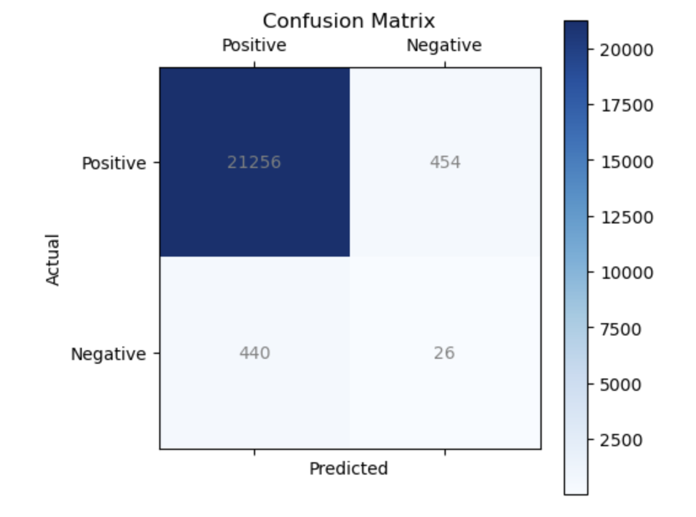

# Naive Bayes Model to Predict Flight Cancellations

The aviation industry is dynamic with various variables impacting flight operations. A prominent airline company in the Pacific Northwest has accumulated extensive data related to flights and weather patterns and needs to understand the factors influencing the departure delays and cancellations to benefit both airlines and passengers. These datasets provide comprehensive information on flights departing in the first half of 2022 from both of the two major airports in this region: SEA (Seattle-Tacoma International Airport) and PDX (Portland International Airport):

This project seeks to analyze the `flights2022.csv` dataset containing *111,006* flight records and *29* fields.

The project consists of two parts:

## I. Data Manipulation, EDA and Visualizations  

## II. Naive Bayes Classifier to Predict Flight Cancellations
