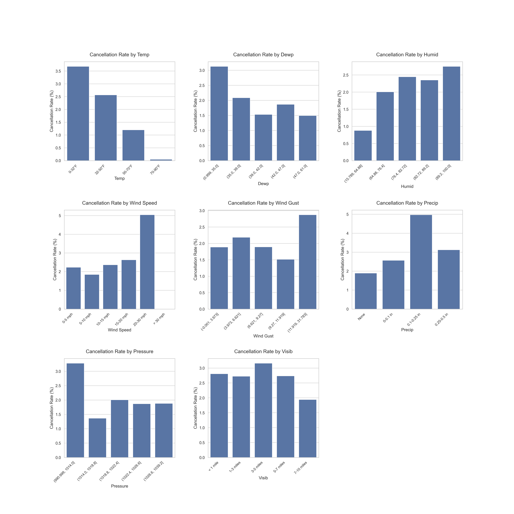
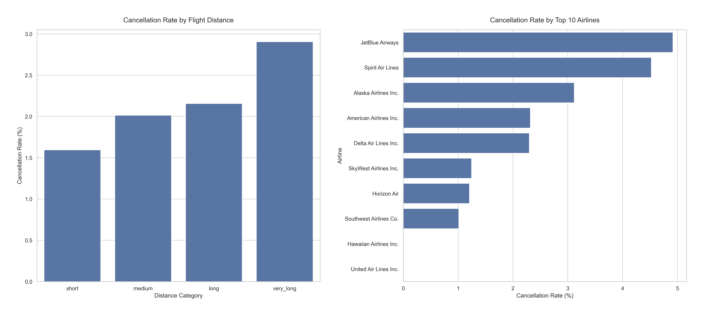
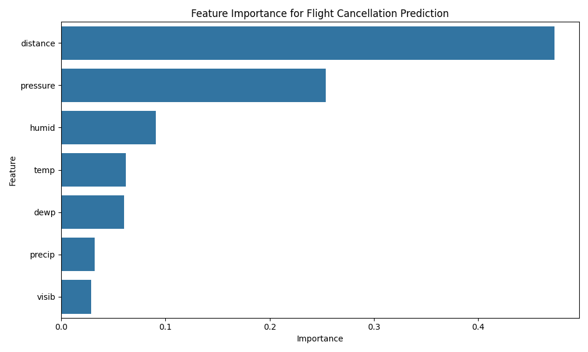

# Analyzing Flight Patterns Using Supervised ML Algorithm

The aviation industry is dynamic with various variables impacting flight operations. A prominent airline company in the Pacific Northwest has accumulated extensive data related to flights and weather patterns and needs to understand the factors influencing the departure delays and cancellations to benefit both airlines and passengers. These datasets provide comprehensive information on flights departing in the first half of 2022 from both of the two major airports in this region: SEA (Seattle-Tacoma International Airport) and PDX (Portland International Airport):

This project seeks to analyze the `flights2022.csv` dataset containing *111,006* flight records and *29* fields.

# Dataset Description

The dataset contains the following variables:

| **Column**           | **Data Type** | **Description**                                                                                                 | **Example Values**                 |
|----------------------|---------------|-----------------------------------------------------------------------------------------------------------------|------------------------------------|
| **year**             | int64         | Calendar year of the flight.                                                                                    | 2022                               |
| **month**            | int64         | Month of the flight (1–12).                                                                                     | 1, 2, ..., 12                      |
| **day**              | int64         | Day of the month (1–31).                                                                                        | 1, 2, 3, ...                       |
| **dep_time**         | float64       | Actual departure time in "HHMM" format (no colon). NA = cancelled flight.                                       | 1.0, 10.0, 25.0, 1305.0            |
| **sched_dep_time**   | int64         | Scheduled departure time in "HHMM" format.                                                                      | 2359, 2250, 2355                   |
| **dep_delay**        | float64       | Departure delay in minutes. Positive values = minutes late, negative = minutes early, zero = on time.           | 2.0, 71.0, 15.0                    |
| **arr_time**         | float64       | Actual arrival time in "HHMM" format (float).                                                                   | 604.0, 242.0, 759.0                |
| **sched_arr_time**   | int64         | Scheduled arrival time in "HHMM" format.                                                                        | 618, 142, 730                      |
| **arr_delay**        | float64       | Arrival delay in minutes. Positive = late arrival, negative = early arrival.                                    | -14.0, 60.0, 29.0                  |
| **carrier**          | object        | Two-letter airline carrier code.                                                                                | "UA", "AS", "AA"                   |
| **flight**           | int64         | Flight number assigned by the carrier.                                                                          | 1545, 15, 43                       |
| **tailnum**          | object        | Aircraft tail number (unique plane identifier).                                                                 | "N738MA", "N419AS"                 |
| **origin**           | object        | Origin airport where flight starts (IATA code).                                                                 | "JFK", "LGA", "EWR"                |
| **dest**             | object        | Destination airport where flight lands (IATA code).                                                             | "SEA", "SFO", "ORD"                |
| **air_time**         | float64       | Flight time in the air (minutes).                                                                               | 300.0, 200.0, etc.                 |
| **distance**         | int64         | Distance between airports (miles).                                                                              | 250, 800, 2475                     |
| **hour**             | int64         | Extracted hour portion of scheduled departure time (0–23).                                                      | 23, 22, etc.                       |
| **minute**           | int64         | Extracted minute portion of scheduled departure time (0–59).                                                    | 59, 50, etc.                       |
| **time_hour**        | object        | Date/Time Recorded.                                                                                            | "2022-01-01 23:00:00"              |
| **airline**          | object        | Carrier/airline name.                                                                                           | "United Air Lines Inc.", "Alaska Airlines Inc." |
| **temp**             | float64       | Recorded temperature (in Fahrenheit) at the origin airport (from weather data).                                 | 33.0, 32.0, etc.                   |
| **dewp**             | float64       | Dew Point Temperature (in degrees Fahrenheit).                                                                  | 23.0, 19.0, etc.                   |
| **humid**            | float64       | Relative humidity percentage.                                                                                  | 66.06, 69.04, etc.                 |
| **wind_dir**         | float64       | Wind direction (in degrees, 0–360).                                                                             | 160.0, 170.0, etc.                 |
| **wind_speed**       | float64       | Wind speed (in mph).                                                                                            | 8.05546, 9.20624, etc.             |
| **wind_gust**        | float64       | Wind gust speed (in mph).                                                                                       | 9.270062, 10.594357, etc.          |
| **precip**           | float64       | Precipitation (in inches) recorded at departure airport.                                                        | 0.0, 0.5, etc.                     |
| **pressure**         | float64       | Atmospheric Pressure (in hPa).                                                                                 | 1022.9, 1023.4, etc.               |
| **visib**            | float64       | Visibility (in miles).                                                                                          | 10.0, 4.0, etc.                    |

# Table of Contents

- [Analyzing Flight Patterns Using Supervised ML Algorithm](#analyzing-flight-patterns-using-supervised-ml-algorithm)
- [Dataset Description](#dataset-description)
- [Table of Contents](#table-of-contents)
  - [I. Data Processing and Methodology](#i-data-processing-and-methodology)
    - [Data Cleaning and Preprocessing](#data-cleaning-and-preprocessing)
      - [1. Handling Missing Values](#1-handling-missing-values)
      - [2. Time Format Standardization](#2-time-format-standardization)
      - [3. Feature Engineering](#3-feature-engineering)
  - [II. Arrival \& Departure Delay Deep-Dive ](#ii-arrival--departure-delay-deep-dive-)
    - [Key Findings from Analysis](#key-findings-from-analysis)
  - [III. Predictive Modeling for Flight Cancellations](#iii-predictive-modeling-for-flight-cancellations)
    - [Modeling Approach](#modeling-approach)
    - [Evaluation Metrics](#evaluation-metrics)
    - [Phase 1 - Initial Run with Default Parameters](#phase-1---initial-run-with-default-parameters)
    - [Phase 2 - Fine-tuning Hyperparameters to Address Class Imbalance](#phase-2---fine-tuning-hyperparameters-to-address-class-imbalance)
    - [Techniques to Address Class Imbalance](#techniques-to-address-class-imbalance)
      - [Stratified Cross-Validation](#stratified-cross-validation)
      - [Resampling Methods](#resampling-methods)
      - [Class Weighting](#class-weighting)
      - [Perfomance Metrics After Hyperparameters Fine-tuning](#perfomance-metrics-after-hyperparameters-fine-tuning)
    - [Feature Importance Analysis](#feature-importance-analysis)
    - [Detailed Model Evaluation](#detailed-model-evaluation)
    - [Model Performance Comparison (Cross-Validation)](#model-performance-comparison-cross-validation)
    - [Model Performance Comparison (Test Set)](#model-performance-comparison-test-set)
    - [Best Performing Model Based on AUC](#best-performing-model-based-on-auc)
    - [Insights](#insights)
      - [Model Recommendations](#model-recommendations)
      - [Recommendations Based on Business Goals](#recommendations-based-on-business-goals)
  - [IV. Further Enhancing Considerations](#iv-further-enhancing-considerations)
      - [Feature Engineering](#feature-engineering)
      - [Potential Overfitting](#potential-overfitting)
      - [Threshold Adjustment](#threshold-adjustment)
  - [V. Conclusion](#v-conclusion)

## I. Data Processing and Methodology

### Data Cleaning and Preprocessing

#### 1. Handling Missing Values
The dataset contained various types of missing values, which were addressed using different strategies:

- **Flight Cancellations:** Missing values in `dep_time` indicated cancelled flights (1.3% of records). These were preserved as they represent a key target variable.
- **Tailnum:** Records with missing aircraft identifiers (0.12% of records) were removed, as they constituted a negligible portion of the data.
- **Weather Data:** Missing values in `wind_dir`, `wind_speed`, and `wind_gust` were imputed using a KNN Imputer with `n_neighbors=5` and distance-weighted averaging to maintain relationships between weather variables.

#### 2. Time Format Standardization
[Standardizing time formats and resolving day transition issues](./notebooks/Flights_Project.ipynb) were critical preprocessing steps.

- **Datetime Conversion:** Transformed `HHMM`-formatted times into proper datetime objects, accounting for date transitions.
- **Day Transition Handling:** Addressed flights crossing midnight using logical rules:
  - Adjusted departure times based on `dep_delay` values.
  - Corrected arrival times using factors such as `dep_time`, `air_time`, and `arr_delay`.
  - Handled special cases requiring multiple condition adjustments.
  - Applied specific handling for midnight (`24:00`) departure times.

#### 3. Feature Engineering
New features were created to enhance model performance and support exploratory analysis:

- **Time-Based Features:** `day_of_week`, `is_weekend`, `is_holiday`, `month_name`, `season`.
- **Flight Metrics:** `flight_duration`, `scheduled_duration`, `duration_difference`.
- **Categorical Features:** `route` (origin-destination pair).
- **Binary Flags:** `cancel` (derived from NA values in `dep_time`).

## II. Arrival & Departure Delay Deep-Dive  

### Key Findings from Analysis
- The transformed dataset contains **110,878 flight records** with a **cancellation rate of 2.09%**
- **June** is the busiest month with **20,120 flights**, where as **February** records lowest number of flights at **16,014 flights**
- Looking at **average daily arrival** delay from 2022-01 to 2022-07, on the best day, planes arrive **9 minutes 57 seconds** sooner than scheduled, while for the worst performing day planes are delayed up to **44 minutes 40 seconds**  
- Weekly analysis finds that on average, planes that depart on **Sunday** delay the most at **10 minutes 42 seconds** from scheduled departure, while planes on Tuesday arrive **1 minute 36 seconds** soonder than scheduled 
- Planes departing to **DSM** records highest number of arrival delays, at **32 minutes and 30 seconds** on average
- Flights from **PDX** on average performs better than from **SEA** with **54 seconds** difference in **departure delay** 
- Flights from **PDX to GRR** are recorded to have highest deviation of estimated duration to scheduled duration, at **55 minutes and 12 seconds**

<!-- 

## II. Cancellation Rate Deep-Dive  

### Routes & Airlines Analysis

### Time-Based Patterns
Flight cancellations show distinct patterns across different time dimensions, including months, days of the week, and hours of the day. These patterns provide insights into operational challenges and potential factors affecting cancellations.

*Cancellation rates by month, day of week, hour, and season*

### Weather Impact Analysis
Weather conditions significantly impact flight operations. The analysis examines how different weather factors, such as temperature, visibility, precipitation, and wind, correlate with flight cancellations.

*Relationship between weather conditions and cancellation rates*

### Distance and Airline Analysis
Different airlines have varying operational practices and fleet characteristics, resulting in different cancellation rates. Similarly, flight distance can affect cancellation probabilities due to operational complexity and exposure to changing weather conditions along the route.

*Cancellation rates by flight distance and top airlines* -->

## III. Predictive Modeling for Flight Cancellations

### Modeling Approach
The primary modeling task was predicting flight cancellations using weather and flight-specific features. Models were evaluated using **train/test/validation** approach and multiple performance metrics:

### Evaluation Metrics

- **Accuracy:** Measures overall correctness but can be misleading for imbalanced datasets.
- **Precision:** Proportion of predicted cancellations that were actual cancellations.
- **Recall:** Proportion of actual cancellations correctly identified by the model.
- **F1-Score:** Harmonic mean of precision and recall, balancing the two metrics.
- **AUC-ROC:** Area under the Receiver Operating Characteristic curve, indicating the model's ability to distinguish between classes.

### Phase 1 - Initial Run with Default Parameters

*Side-by-side comparison of all performance metrics on training data in initial run by model*

I evaluated multiple machine learning models for their ability to predict flight cancellations using cross-validation with multiple performance metrics (accuracy, precision, recall, and F1-Score). While all models achieve high accuracy due to class imbalance in the dataset (very few flights are cancelled compared to those that operate normally), there are significant differences in precision, recall, and F1-Score, which are more important metrics for imbalanced classification problems like flight cancellation prediction.

### Phase 2 - Fine-tuning Hyperparameters to Address Class Imbalance
### Techniques to Address Class Imbalance

To tackle the class imbalance problem in the dataset, the following techniques were employed:
<!--  -->

#### Stratified Cross-Validation
- **StratifiedKFold:** Utilized StratifiedKFold with 5 splits to ensure the class distribution was maintained across all folds during cross-validation.

#### Resampling Methods
- **SMOTE (Synthetic Minority Over-sampling Technique):** Generated synthetic examples for the minority class to balance the dataset.
- **SMOTETomek:** Combined SMOTE with Tomek links to oversample the minority class while cleaning boundary samples.
- **SMOTEENN:** Combined Over and Under Sampling using SMOTE and Edited Nearest Neighbors. 
- **RandomOverSampler:** Performed simple oversampling of the minority class.
- **RandomUnderSampler:** Reduced the size of the majority class by randomly undersampling.

#### Class Weighting
- **Algorithm-Specific Weighting:**
  - Applied `class_weight='balanced'` for Random Forest and Logistic Regression.
  - Used the `scale_pos_weight` parameter in XGBoost to adjust for class imbalance.
  - Used `subsample` = 0.8 to introduce randomness, reduce overfitting by giving the minority class samples a better chance of being inflential and `loss` = log_loss to penalize incorrect predictions in Gradient Boosted Trees.

#### Perfomance Metrics After Hyperparameters Fine-tuning 

*Side-by-side comparison of all performance metrics on training data after resampling with SMOTEENN*

### Feature Importance Analysis

*Top features for predicting flight cancellations using Random Forest model*

The feature importance analysis highlights that distance, pressure, and humid are the most influential factors in predicting flight cancellations.

<!-- ### Detailed Model Evaluation with Confusion Matrices -->

<!-- #### Naive Bayes

*Confusion matrix for Naive Bayes model*

The Naive Bayes model provides a reasonable baseline with better recall than other models but suffers from lower precision, resulting in many false positives.

#### Random Forest

*Confusion matrix for Random Forest model*

Random Forest achieves the best overall performance with the highest F1-Score, providing a good balance between precision and recall for flight cancellation prediction.

#### Gradient Boosting

*Confusion matrix for Gradient Boosting model*

Gradient Boosting achieves high accuracy and precision but suffers from extremely low recall, resulting in a very low F1-Score.

#### Logistic Regression

*Confusion matrix for Logistic Regression model*

Logistic Regression yields zero precision, recall, and F1-Score despite high accuracy, highlighting the limitation of accuracy as a metric for imbalanced datasets. -->

### Detailed Model Evaluation

[After trials and errors (Summary_Performance_Metrics.pdf)](./Summary_Performance_Metrics.pdf) in experimenting with different hyperparameters, it turns out that using SMOTEENN with class weight yields the highest F-1 score. Below is a detailed snapshot of the performance metrics across multiple models.

### Model Performance Comparison (Cross-Validation)

| **Model**            | **Accuracy** | **Precision** | **Recall** | **F1-Score** |
|-----------------------|--------------|---------------|------------|--------------|
| Naive Bayes          | 0.6115       | 0.6338        | 0.5591     | 0.5941       |
| Random Forest        | 0.9957       | 0.9982        | 0.9934     | 0.9958       |
| Gradient Boosting    | 0.8353       | 0.8197        | 0.8667     | 0.8426       |
| XGBoost              | 0.8756       | 0.8042        | 0.9984     | 0.8909       |
| Logistic Regression  | 0.6379       | 0.6389        | 0.6622     | 0.6503       |

### Model Performance Comparison (Test Set)

| **Model**            | **Accuracy** | **Precision** | **Recall** | **F1-Score** |
|-----------------------|--------------|---------------|------------|--------------|
| Naive Bayes          | 0.6492       | 0.0339        | 0.5708     | 0.0640       |
| Random Forest        | 0.9569       | 0.2225        | 0.4206     | 0.2910       |
| Gradient Boosting    | 0.7700       | 0.0524        | 0.5815     | 0.0961       |
| XGBoost              | 0.7185       | 0.0569        | 0.7961     | 0.1062       |
| Logistic Regression  | 0.5953       | 0.0324        | 0.6330     | 0.0617       |

### Best Performing Model Based on AUC

On final testing evaluation, **XGBoost** achieved the highest AUC score of **0.8251**, making it the best-performing model in terms of distinguishing between classes.

### Insights

Resampling techniques such as SMOTE and random over/undersampling generally improve recall but may reduce precision. The choice of method depends on whether the priority is minimizing false negatives (higher recall) or false positives (higher precision).

Parameter tuning (e.g., `scale_pos_weight`, `class_weight`, `subsample`) can significantly enhance model performance but often shifts the trade-off between recall and precision. Additionally, fine-tuning the decision threshold (e.g., adjusting the probability cutoff in XGBoost or Random Forest) is crucial for optimizing metrics like F1-Score or recall in practice.

#### Model Recommendations
The choice of the best model depends on the specific criteria valued by stakeholders. Below are the top-performing models based on different metrics:

- **Best Test-Set AUC:**  
  - **Model:** XGBoost (Default, no resampling)  
  - **AUC:** 0.8517  

- **Best Test-Set F1-Score:**  
  - **Model:** Random Forest + SMOTEENN  
  - **F1-Score:** 0.291  

- **Best Test-Set Accuracy:**  
  - **Model:** XGBoost (Default, no resampling)  
  - **Accuracy:** 0.979843  

- **Best Test-Set Recall:**  
  - **Model:** XGBoost + SMOTE + `scale_pos_weight`  
  - **Recall:** 0.783262  

#### Recommendations Based on Business Goals
- **Maximizing AUC or Accuracy:**  
  Deploy **XGBoost (Default)** for its superior AUC and accuracy.

- **Balancing Precision and Recall (F1-Score):**  
  Use **Random Forest + SMOTEENN** for a more balanced performance.

- **Catching Most Cancellations (Recall):**  
  Opt for **XGBoost + SMOTE + `scale_pos_weight`** to maximize recall and identify the majority of cancellations.

The final choice should align with the business objective, whether it is minimizing operational disruptions, improving customer satisfaction, or optimizing resource allocation.

## IV. Further Enhancing Considerations

#### Feature Engineering
Analyze and engineer features that are more predictive of the target variable to improve model performance on unseen data:
  - **Weather Severity Features:** Combine weather variables (e.g., wind speed, precipitation, and visibility) into a single severity index.
  - **Time-Based Features:** Extract features like season, day of the week, or time of day to capture temporal patterns.
  - **Distance Categories:** Group flight distances into categories (e.g., short-haul, medium-haul, long-haul) to identify trends based on distance.

#### Potential Overfitting
- **Observation:** All models show a significant drop in precision when evaluated on the test set compared to cross-validation results.
- **Implication:** This decline suggests potential overfitting, where models capture noise or patterns specific to the training data that do not generalize well to unseen data.
- **Mitigation Strategies:**
  - Use regularization techniques (e.g., L1/L2 regularization).
  - Increase the size of the training dataset through data augmentation or synthetic data generation.
  - Simplify the model by reducing the number of features or using feature selection techniques.

#### Threshold Adjustment
- Adjust the decision threshold to balance precision and recall based on the specific requirements of the application.
- For example:
  - Lower the threshold to prioritize recall (e.g., identifying more cancellations).
  - Raise the threshold to prioritize precision (e.g., reducing false positives).

## V. Conclusion
The analysis reveals the challenge of predicting rare events like flight cancellations, which occur in only about 2% of flights in our dataset. While all models achieve high accuracy due to this class imbalance, the **Random Forest** model provides the best overall performance when considering the more meaningful F1-Score metric.

The feature importance analysis confirms that flight distance along with weather-related factors (particularly pressure and visibility) are the most critical predictors, highlighting areas where airlines can focus their operational improvements to minimize cancellations.

<!-- ## IV. Recommendations

### Operational Recommendations
- **Proactive Delay Management:** Since delays correlate strongly with cancellations, implementing more effective delay management strategies could help reduce cancellation rates
- **Weather-Based Planning:** Develop more sophisticated weather contingency plans, particularly focusing on humidity, precipitation, and pressure changes
- **Airline-Specific Strategies:** Airlines with higher cancellation rates should analyze their operations to identify specific areas for improvement
- **Seasonal Preparedness:** Allocate additional resources during seasons with historically higher cancellation rates
- **Enhanced Predictive Systems:** Implement machine learning models (particularly Random Forest or Gradient Boosting) for early cancellation prediction to improve passenger notification and resource reallocation

### Further Research Opportunities
- Develop more detailed analysis of specific routes and airports to identify localized cancellation patterns
- Investigate the relationship between aircraft type and cancellation probability
- Explore the impact of staffing levels and crew scheduling on cancellation rates
- Analyze the economic impact of different cancellation prediction and management strategies
 -->
