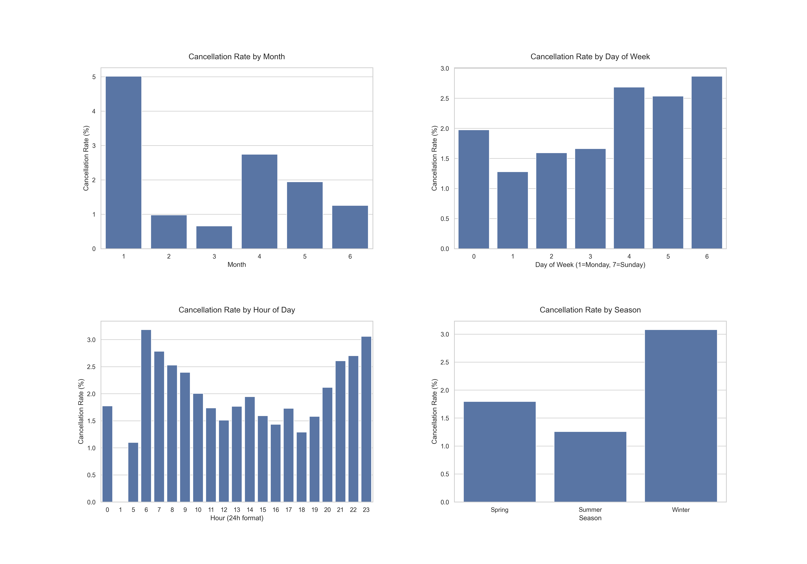

# Naive Bayes Model to Predict Flight Cancellations

The aviation industry is dynamic with various variables impacting flight operations. A prominent airline company in the Pacific Northwest has accumulated extensive data related to flights and weather patterns and needs to understand the factors influencing the departure delays and cancellations to benefit both airlines and passengers. These datasets provide comprehensive information on flights departing in the first half of 2022 from both of the two major airports in this region: SEA (Seattle-Tacoma International Airport) and PDX (Portland International Airport):

This project seeks to analyze the `flights2022.csv` dataset containing *111,006* flight records and *29* fields.

## Dataset Description

The dataset contains the following variables:

| **Column**           | **Data Type** | **Description**                                                                                                 | **Example Values**                 |
|----------------------|---------------|-----------------------------------------------------------------------------------------------------------------|------------------------------------|
| **year**             | int64         | Calendar year of the flight.                                                                                    | 2022                               |
| **month**            | int64         | Month of the flight (1–12).                                                                                     | 1, 2, ..., 12                      |
| **day**              | int64         | Day of the month (1–31).                                                                                        | 1, 2, 3, ...                       |
| **dep_time**         | float64       | Actual departure time in "HHMM" format (no colon). NA = cancelled flight.                                       | 1.0, 10.0, 25.0, 1305.0            |
| **sched_dep_time**   | int64         | Scheduled departure time in "HHMM" format.                                                                      | 2359, 2250, 2355                   |
| **dep_delay**        | float64       | Departure delay in minutes. Positive values = minutes late, negative = minutes early, zero = on time.           | 2.0, 71.0, 15.0                    |
| **arr_time**         | float64       | Actual arrival time in "HHMM" format (float).                                                                   | 604.0, 242.0, 759.0                |
| **sched_arr_time**   | int64         | Scheduled arrival time in "HHMM" format.                                                                        | 618, 142, 730                      |
| **arr_delay**        | float64       | Arrival delay in minutes. Positive = late arrival, negative = early arrival.                                    | -14.0, 60.0, 29.0                  |
| **carrier**          | object        | Two-letter airline carrier code.                                                                                | "UA", "AS", "AA"                   |
| **flight**           | int64         | Flight number assigned by the carrier.                                                                          | 1545, 15, 43                       |
| **tailnum**          | object        | Aircraft tail number (unique plane identifier).                                                                 | "N738MA", "N419AS"                 |
| **origin**           | object        | Origin airport where flight starts (IATA code).                                                                 | "JFK", "LGA", "EWR"                |
| **dest**             | object        | Destination airport where flight lands (IATA code).                                                             | "SEA", "SFO", "ORD"                |
| **air_time**         | float64       | Flight time in the air (minutes).                                                                               | 300.0, 200.0, etc.                 |
| **distance**         | int64         | Distance between airports (miles).                                                                              | 250, 800, 2475                     |
| **hour**             | int64         | Extracted hour portion of scheduled departure time (0–23).                                                      | 23, 22, etc.                       |
| **minute**           | int64         | Extracted minute portion of scheduled departure time (0–59).                                                    | 59, 50, etc.                       |
| **time_hour**        | object        | Date/Time Recorded.                                                                                            | "2022-01-01 23:00:00"              |
| **airline**          | object        | Carrier/airline name.                                                                                           | "United Air Lines Inc.", "Alaska Airlines Inc." |
| **temp**             | float64       | Recorded temperature (in Fahrenheit) at the origin airport (from weather data).                                 | 33.0, 32.0, etc.                   |
| **dewp**             | float64       | Dew Point Temperature (in degrees Fahrenheit).                                                                  | 23.0, 19.0, etc.                   |
| **humid**            | float64       | Relative humidity percentage.                                                                                  | 66.06, 69.04, etc.                 |
| **wind_dir**         | float64       | Wind direction (in degrees, 0–360).                                                                             | 160.0, 170.0, etc.                 |
| **wind_speed**       | float64       | Wind speed (in mph).                                                                                            | 8.05546, 9.20624, etc.             |
| **wind_gust**        | float64       | Wind gust speed (in mph).                                                                                       | 9.270062, 10.594357, etc.          |
| **precip**           | float64       | Precipitation (in inches) recorded at departure airport.                                                        | 0.0, 0.5, etc.                     |
| **pressure**         | float64       | Atmospheric Pressure (in hPa).                                                                                 | 1022.9, 1023.4, etc.               |
| **visib**            | float64       | Visibility (in miles).                                                                                          | 10.0, 4.0, etc.                    |

## Arrival & Departure Delay Deep-Dive  
<!-- 
 -->

### Key Findings from Analysis
- The dataset contains **110,878 flight records** with a **cancellation rate of 2.09%**
- Weather factors significantly impact cancellations, particularly humidity, pressure, and precipitation
- Different airlines show varying cancellation rates, suggesting differences in operational robustness
- Seasonal patterns exist in cancellation rates, with certain months showing higher rates
- Flight duration and air time are strong predictors of cancellations, suggesting longer flights may be more prone to cancellation
- Arrival and departure delays strongly correlate with cancellations, indicating that operational disruptions tend to cascade

## II. Cancellation Rate Deep-Dive  

### Routes & Airlines Analysis

### Time-Based Patterns
Flight cancellations show distinct patterns across different time dimensions, including months, days of the week, and hours of the day. These patterns provide insights into operational challenges and potential factors affecting cancellations.

*Cancellation rates by month, day of week, hour, and season*

### Weather Impact Analysis
Weather conditions significantly impact flight operations. The analysis examines how different weather factors, such as temperature, visibility, precipitation, and wind, correlate with flight cancellations.

*Relationship between weather conditions and cancellation rates*

### Distance and Airline Analysis
Different airlines have varying operational practices and fleet characteristics, resulting in different cancellation rates. Similarly, flight distance can affect cancellation probabilities due to operational complexity and exposure to changing weather conditions along the route.

*Cancellation rates by flight distance and top airlines*

## III. Predictive Modeling for Flight Cancellations

### Feature Importance Analysis

*Top features for predicting flight cancellations using Random Forest model*

The feature importance analysis highlights that distance, pressure, and humid are the most influential factors in predicting flight cancellations.

### Model Performance Comparison
We evaluated multiple machine learning models for their ability to predict flight cancellations using cross-validation with multiple performance metrics:

*Detailed performance metrics across different models*

While all models achieve high accuracy due to class imbalance in the dataset (very few flights are cancelled compared to those that operate normally), the F1-Score provides a more balanced assessment of model performance.

### Combined Metrics Analysis

*Side-by-side comparison of all performance metrics by model*

This visualization demonstrates that despite high accuracy across all models, there are significant differences in precision, recall, and F1-Score, which are more important metrics for imbalanced classification problems like flight cancellation prediction.

### Detailed Model Evaluation with Confusion Matrices

#### Naive Bayes

*Confusion matrix for Naive Bayes model*

The Naive Bayes model provides a reasonable baseline with better recall than other models but suffers from lower precision, resulting in many false positives.

#### Random Forest

*Confusion matrix for Random Forest model*

Random Forest achieves the best overall performance with the highest F1-Score, providing a good balance between precision and recall for flight cancellation prediction.

#### Gradient Boosting

*Confusion matrix for Gradient Boosting model*

Gradient Boosting achieves high accuracy and precision but suffers from extremely low recall, resulting in a very low F1-Score.

#### Logistic Regression

*Confusion matrix for Logistic Regression model*

Logistic Regression yields zero precision, recall, and F1-Score despite high accuracy, highlighting the limitation of accuracy as a metric for imbalanced datasets.

### Performance Metrics Summary
Based on cross-validation results across multiple metrics:

| Model | Accuracy | Precision | Recall | F1-Score |
|-------|----------|-----------|--------|----------|
| Naive Bayes | 0.9591 | 0.0581 | 0.0634 | 0.0606 |
| Random Forest | 0.9764 | 0.3711 | 0.1896 | 0.2509 |
| Gradient Boosting | 0.9791 | 0.0800 | 0.0011 | 0.0021 |
| Logistic Regression | 0.9792 | 0.0000 | 0.0000 | 0.0000 |

**Best Performing Model:** Random Forest with an F1-Score of 0.2509, providing the most balanced performance between precision and recall for flight cancellation prediction.

### Conclusion
The analysis reveals the challenge of predicting rare events like flight cancellations, which occur in only about 2% of flights in our dataset. While all models achieve high accuracy due to this class imbalance, the Random Forest model provides the best overall performance when considering the more meaningful F1-Score metric.

The feature importance analysis confirms that weather-related factors (particularly pressure and visibility) along with flight distance are the most critical predictors, highlighting areas where airlines can focus their operational improvements to minimize cancellations.

It's worth noting that even with the best model, the relatively low F1-Score (0.2509) indicates that predicting flight cancellations remains challenging, likely due to the complex and sometimes unpredictable nature of factors contributing to cancellations. Future work could explore ensemble approaches, additional feature engineering, or addressing the class imbalance through techniques like oversampling or undersampling.

### Advanced Modeling
TODO:
1. Feature engineering (creating weather severity features, time-based features, and distance categories)
2. Hyperparameter tuning for the best-performing models
3. ROC curve and Precision-Recall curve analysis

Tree-based models (Random Forest and Gradient Boosting) generally performed best, with enhanced features and hyperparameter tuning providing additional improvements.

## IV. Recommendations

### Operational Recommendations
- **Proactive Delay Management:** Since delays correlate strongly with cancellations, implementing more effective delay management strategies could help reduce cancellation rates
- **Weather-Based Planning:** Develop more sophisticated weather contingency plans, particularly focusing on humidity, precipitation, and pressure changes
- **Airline-Specific Strategies:** Airlines with higher cancellation rates should analyze their operations to identify specific areas for improvement
- **Seasonal Preparedness:** Allocate additional resources during seasons with historically higher cancellation rates
- **Enhanced Predictive Systems:** Implement machine learning models (particularly Random Forest or Gradient Boosting) for early cancellation prediction to improve passenger notification and resource reallocation

### Further Research Opportunities
- Develop more detailed analysis of specific routes and airports to identify localized cancellation patterns
- Investigate the relationship between aircraft type and cancellation probability
- Explore the impact of staffing levels and crew scheduling on cancellation rates
- Analyze the economic impact of different cancellation prediction and management strategies

